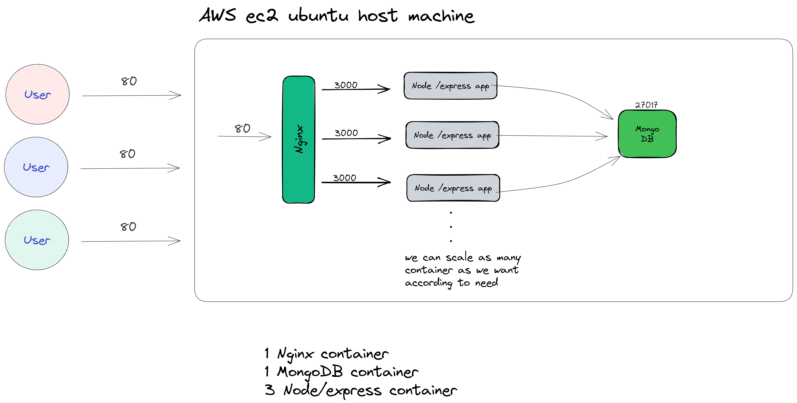

## Multi container backend with node/express, redis, mongodb & docker

## Application architecture



## Server folder architecture

```yml
|- app
    |- index.js
    |- controllers/
    |- middlewares/
    |- routes/
    |- models/
    |- config/
    |- nginx/
    |- package.json
    |- package-lock.json
    |- Dockerfile
    |- docker-compose.yml
    |- docker-compose.prod.yml
    |- docker-compose.dev.yml
    |- docker-compose.backup.yml
    |- .gitignore
    |- .dockerignore
|- docker-compose-down.sh
|- docker-compose-up.sh
```

### To start a application

```shell
./docker-compose-up.sh
```

### To stop application

```shell
./docker-compose-down.sh
```

#### Content of docker-compose-up.sh

```shell
docker compose --env-file .env -f docker-compose.yml -f docker-compose.prod.yml up -d --build
```

#### Content of docker-compose-down.sh

```shell
docker compose -f docker-compose.yml -f docker-compose.prod.yml down
```

#### To re-build a specific image on production (eg. mongodb & nginx images may not be needed to re-build every-time application-logic changes...)

```shell
docker compose --env-file .env -f docker-compose.yml -f docker-compose.prod.yml up -d --build backend
```

here image that must be re-build is `backend`

we can even pass `--no-deps` flag to not re-build the image on that the our changing image depends

## Current production workflow


Developer build image on dev server it-self & push it to dockerhub, then production server pull that image from dockerhub & run `docker compose up` and starts all containers.
By building image on dev-server, it reduce compute power of production server which is good for application performance

## Previous production workflow


Developer push changes to github, then production server takes `git pull` & re-build the image which takes more compute power of production server which is not good for application. After re-building it run `docker compose up` and starts all containers.

### To install docker on ubuntu server

go to
[https://get.docker.com/](https://get.docker.com/)
